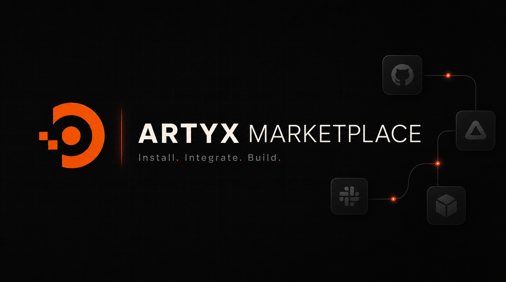

<div align="center">



# Artyx Marketplace

**Curated MCP servers and skills for the [Artyx](https://artyx.ai) agent.**

</div>

---

## What This Repo Is

Artyx Marketplace is a git-backed catalog of installable plugins for Artyx.

The core rule is simple: [`.agents/plugins/marketplace.json`](.agents/plugins/marketplace.json)
is an OpenAI-style curated index, and each plugin under `plugins/<name>/` is a
self-describing bundle. The plugin's `.artyx-plugin/plugin.json` carries all
plugin metadata.

The marketplace contains ordered policy-aware pointers:

```json
{
  "name": "blender",
  "source": { "source": "local", "path": "./plugins/blender" },
  "policy": { "installation": "AVAILABLE", "authentication": "ON_INSTALL" },
  "category": "Creativity"
}
```

Array order is the curation order shown by Artyx. The index controls
availability and install-time authentication; the manifest owns the plugin's
storefront copy and bundled surfaces.

Publishing is merging to `main`. There are no releases, tags, package uploads,
or generated catalogs.

## Plugin Layout

```text
plugins/<name>/
|-- .artyx-plugin/plugin.json       # required manifest
|-- skills/<id>/SKILL.md            # optional, one or more skills
|-- .mcp.json                       # optional MCP server config
|-- assets/                         # optional icons, logos, screenshots, binaries
|-- agents/                         # reserved for future agent bundles
|-- commands/                       # reserved for future command bundles
|-- hooks.json                      # reserved for future hooks
`-- README.md                       # plugin docs and setup notes
```

Plugins can contain MCP config, skills, assets, or any combination that matches
the manifest. The validator allows the reserved `agents/`, `commands/`, and
`hooks.json` paths for forward compatibility.

Secrets and user-specific settings in `.mcp.json` use bare `${VAR}`
placeholders. Artyx resolves reserved app variables such as `${ARTYX_ELECTRON}`
and `${ARTYX_BUNDLED}`; other placeholders are prompted for by the desktop app.

## Manifest

Each plugin manifest lives at:

```text
plugins/<name>/.artyx-plugin/plugin.json
```

The manifest is strict JSON validated by
[`schema/plugin.schema.json`](schema/plugin.schema.json). Required top-level
fields are `name`, `version`, `description`, `author`, and `interface`.

The `interface` block is the storefront card:

| Field | Required | Purpose |
| --- | --- | --- |
| `displayName` | Yes | Human-readable plugin name. |
| `shortDescription` | Yes | Short storefront summary. |
| `category` | Yes | Storefront category, matching the marketplace entry. |
| `longDescription` | No | Longer storefront copy. |
| `capabilities` | No | `Interactive`, `Read`, and/or `Write`. |
| `brandColor` | No | Hex color, such as `#EA7600`. |
| `logo` | No | Optional `./assets/...` logo path. |
| `defaultPrompt` | No | Example prompts to start from. |
| `screenshots` | No | Optional screenshot paths. |
| `experimental` | No | Marks the plugin as experimental. |

Plugin surfaces use direct pointers (`skills`, `mcpServers`, `apps`, `agents`,
`commands`, `hooks`). `artyx.companion` is the only Artyx-specific extension;
it supplies required external DCC/MCP setup steps.

## Validate

```bash
npm install
npm run validate
```

Validation checks the marketplace schema, plugin manifests, MCP config,
placeholder names, skill frontmatter, repository limits, symlinks, junk files,
and plugin version bumps.

See [CONTRIBUTING.md](CONTRIBUTING.md) for the contribution checklist and review
rules.
